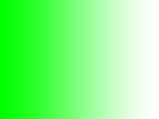

# LinearImageBlending
Blending Images The Real Way (Real, I was the Image)

---
## Preview

### Input

| Input Backdrop | Input Front |
|----------------|-------------|
| Hardcoded Magenta (255, 0, 155) |  |

| sRGB Blending | Linear RGB Blending |
|---------------|---------------------|
|  |  |

---
## Resources
- [How software gets color wrong - Article](https://bottosson.github.io/posts/colorwrong/) (suggested by a friend, was really helpful and he helped me alot through this project)
- [What every coder should know about gamma - Article](https://blog.johnnovak.net/2016/09/21/what-every-coder-should-know-about-gamma/) (Didn't Read it yet, but looks interesting)
- [The Amazing Math behind Colors! - YouTube](https://youtu.be/gnUYoQ1pwes)
- [Computer Color is Broken - YouTube](https://youtu.be/LKnqECcg6Gw)
- [Color Spaces: Explained from the Ground Up - YouTube](https://youtu.be/99v96TL-tuY)

# Thanks

